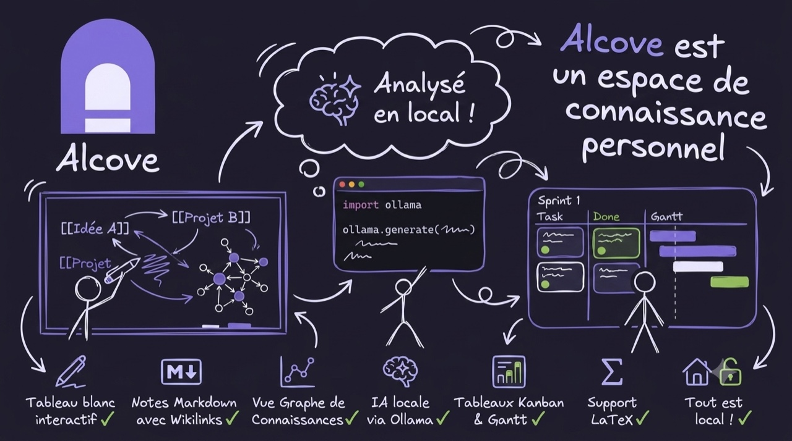

[](https://github.com/KoroKira/alcove/actions/workflows/ci.yml)
[](LICENSE)
[](https://ko-fi.com/guilhemdl)

> Fork personnel de [pad.ws](https://github.com/pad-ws/pad.ws) — un espace de travail visuel combinant tableau blanc (Excalidraw), éditeur de documents et outils de gestion de connaissances personnelle, avec IA locale via Ollama. **Vos notes et votre IA ne quittent jamais votre machine.**
> Je n'ai **rien créé** fondamentalement parlant. Tout ceci n'est que des briques assemblées faites par de plus grands génies que moi, que j'ai adaptées à mes besoins.

[](https://github.com/KoroKira/alcove)

---

## Fonctionnalités

### Pads (types de contenu)

| Type | Description |
|---|---|
| **Canvas** | Tableau blanc Excalidraw — dessins, formes, connexions |
| **Document** | Éditeur Markdown (Monaco) avec preview en temps réel |
| **LaTeX** | Éditeur LaTeX avec compilation PDF intégrée |
| **Kanban** | Tableau à colonnes glissables (À faire / En cours / Terminé) |
| **Gantt** | Diagramme de Gantt interactif (frappe-gantt) |

### Gestion de connaissances

| Feature | Description |
|---|---|
| **Wikilinks** | `[[nom-du-pad]]` — liens entre pads avec autocomplétion |
| **Transclusion** | `![[nom-du-pad]]` — embarque le contenu d'un autre pad |
| **Callouts** | `> [!NOTE]`, `> [!TIP]`, `> [!WARNING]` — blocs style Obsidian |
| **KaTeX** | Formules mathématiques `$inline$` et `$$bloc$$` |
| **Image paste** | Coller une image → base64 dans le Markdown |
| **Table des matières** | Générée automatiquement depuis les titres `##` |
| **Daily notes** | Un pad document par jour, généré automatiquement |
| **Graphe de connaissances** | Vue graphe de tous les wikilinks entre pads |
| **Recherche full-text** | Recherche dans les titres et le contenu de tous les pads |
| **Historique de versions** | Snapshots automatiques (toutes les 5 min) et manuels |
| **Tags** | Étiquettes sur chaque pad, filtrage dans le Dashboard |
| **Flashcards** | Syntaxe `Q:/A:` dans les docs + répétition espacée (SM-2) |
| **Export** | `.md`, PDF (impression), ZIP de tous les pads |
| **Import Obsidian** | Import d'un vault Obsidian (`.md` + images) |

### Assistant IA (Ollama — 100% local)

| Feature | Description |
|---|---|
| **Chat** | Conversation libre avec un modèle local |
| **Résumé** | Résume le document ouvert en 3-5 points |
| **Suggestion de tags** | Génère des tags à partir du contenu |
| **Liens suggérés** | Propose des wikilinks pertinents |
| **RAG** | Recherche sémantique dans tous les pads + réponse contextuelle |
| **Flashcards IA** | Génère des flashcards Q/A depuis un document |
| **Quiz** | Questions/réponses sur le contenu de plusieurs pads |
| **Auto-démarrage** | Ollama est lancé automatiquement s'il est installé mais éteint |

> La qualité des réponses IA dépend du modèle local utilisé — `llama3.2` par défaut. Un modèle plus gros (`OLLAMA_DEFAULT_MODEL`) donne de meilleurs résultats.

### Outils

| Feature | Description |
|---|---|
| **Palette de commandes** | `Cmd+K` — accès rapide à toutes les actions |
| **Dashboard** | Vue de tous les pads avec filtres par tags |
| **Templates canvas** | 5 templates prédéfinis (Réunion, Brainstorm, Kanban…) |
| **Pomodoro** | Timer intégré directement dans l'interface |
| **Terminal local** | Shell zsh embarqué dans un canvas (ttyd) |
| **Thèmes** | Thème clair/sombre par pad + builder de thèmes personnalisés |
| **PWA offline** | Fonctionne hors-ligne via Service Worker |
| **Pad scratch** | Pad épinglé toujours en première position |

---

## Démarrage rapide

### Mode local macOS (recommandé pour un usage solo)

> Nécessite macOS + [Homebrew](https://brew.sh). Pas de Docker, pas de Keycloak.

```bash
git clone https://github.com/KoroKira/alcove.git
cd alcove
bash scripts/run.sh
```

Le script installe automatiquement les dépendances manquantes (PostgreSQL, Redis, ttyd), configure l'environnement et lance tous les services.

**→ Ouvrir [http://localhost:8000](http://localhost:8000)**

Connexion automatique en tant que `local@localhost` (pas de mot de passe).

### Mode Docker (pour partager ou héberger)

> Nécessite [Docker Desktop](https://docs.docker.com/get-docker/) + `jq` (`brew install jq`).

```bash
git clone https://github.com/KoroKira/alcove.git
cd alcove
cp .env.template .env          # Édite les mots de passe avant de continuer
bash scripts/setup.sh          # Premier lancement (~3-5 min)
bash scripts/start.sh          # Démarrage quotidien
```

**→ Ouvrir [http://localhost:8000](http://localhost:8000)**

---

## IA locale (Ollama)

L'assistant IA utilise [Ollama](https://ollama.com) pour tourner entièrement en local — aucune donnée n'est envoyée à un serveur externe.

```bash
# Installer Ollama
brew install ollama

# Télécharger un modèle (exemples)
ollama pull deepseek-r1:1.5b   # rapide, léger (~1 Go)
ollama pull llama3.2           # polyvalent (~2 Go)
ollama pull mistral            # puissant (~4 Go)
```

Si Ollama est installé, l'app le détecte et le lance automatiquement. Le panneau IA s'ouvre avec l'icône ✦ en haut à droite du canvas.

---

## Raccourcis clavier

| Raccourci | Action |
|---|---|
| `Cmd/Ctrl + N` | Nouveau canvas |
| `Cmd/Ctrl + K` | Palette de commandes |
| `Cmd/Ctrl + Shift + F` | Recherche full-text |
| `Cmd/Ctrl + D` | Dashboard |
| `Cmd/Ctrl + G` | Graphe de connaissances |
| `Cmd/Ctrl + J` | Daily note d'aujourd'hui |

---

## Configuration

### Variables principales (`.env.local` pour mode local, `.env` pour Docker)

| Variable | Description | Défaut |
|---|---|---|
| `PAD_DEV_MODE` | Mode local sans auth (auto-login) | `false` |
| `POSTGRES_USER` | Utilisateur PostgreSQL | `(ton username macOS)` |
| `POSTGRES_DB` | Nom de la base de données | `pad` |
| `REDIS_HOST` | Hôte Redis | `localhost` |
| `OLLAMA_URL` | URL du serveur Ollama | `http://localhost:11434` |
| `OLLAMA_DEFAULT_MODEL` | Modèle Ollama par défaut | `llama3.2` |
| `SYNC_DIR` | Dossier de sync locale des pads `.excalidraw` | `~/Documents/pads/` |
| `TTYD_URL` | URL du terminal local (ttyd) | `http://localhost:7681` |

> ⚠️ Changez les mots de passe par défaut dans `.env` avant tout déploiement public.

---

## Structure du projet

```
alcove/
├── src/
│   ├── backend/              # FastAPI (Python 3.11+)
│   │   ├── routers/          # Endpoints API (pad, ai, auth, ws…)
│   │   ├── domain/           # Logique métier (Pad, User, Session)
│   │   ├── database/         # Modèles SQLAlchemy + init DB
│   │   ├── workers/          # Canvas worker (sauvegarde périodique)
│   │   ├── cache/            # Client Redis singleton
│   │   └── config.py         # Variables d'environnement
│   └── frontend/             # React 19 + TypeScript
│       └── src/
│           ├── pad/          # Éditeurs (Document, Kanban, Gantt, LaTeX)
│           ├── ui/           # Composants (Dashboard, AIPanel, Tabs…)
│           ├── hooks/        # State management (usePadTabs, useOllama…)
│           └── lib/          # Collaboration temps réel (WebSocket)
├── scripts/
│   ├── run.sh                # Démarrage local macOS (sans Docker)
│   ├── setup.sh              # Setup initial Docker
│   └── start.sh              # Démarrage quotidien Docker
├── docker-compose.yml
├── .env.template             # Template config Docker
├── .env.local.template       # Template config local macOS
└── SETUP.md                  # Guide d'installation détaillé
```

---

## Stack technique

| Couche | Technologie |
|---|---|
| Frontend | React 19, TypeScript, Excalidraw (fork `@atyrode/excalidraw`) |
| Éditeur | Monaco Editor, marked.js, KaTeX, DOMPurify, Mermaid |
| Backend | FastAPI, SQLAlchemy async, Python 3.11+ |
| Base de données | PostgreSQL 16 (données canvas en JSONB) |
| Cache / WebSocket | Redis |
| Auth | Keycloak (OIDC) en production, `PAD_DEV_MODE=true` en local |
| IA | Ollama (LLM local), nomic-embed-text (embeddings RAG) |
| Build | Vite 5, vite-plugin-pwa (PWA + Service Worker) |

---

## Sécurité & contribution

⚠️ Cette app est conçue pour un **usage local mono-utilisateur**. Le terminal embarqué (ttyd) est un vrai shell sur votre machine : il est lié à `localhost` uniquement et ne doit jamais être exposé sur un réseau. Avant tout déploiement sur serveur, lisez [SECURITY.md](SECURITY.md) et changez tous les mots de passe par défaut du `.env`.

Contributions bienvenues — voir [CONTRIBUTING.md](CONTRIBUTING.md).

---

## Crédits

- [pad.ws](https://github.com/pad-ws/pad.ws) — projet upstream
- [Excalidraw](https://github.com/excalidraw/excalidraw) — moteur de canvas
- [Ollama](https://ollama.com) — inférence LLM locale
- [Alexandrie](https://github.com/Smaug6739/Alexandrie) - Surement l'une des meilleures app qui puisse exister, qui m'a bien inspiré pour mon projet
